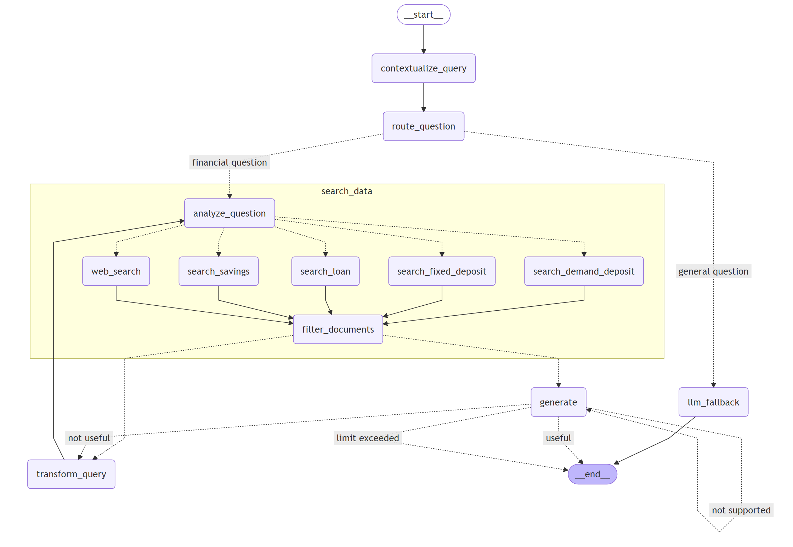
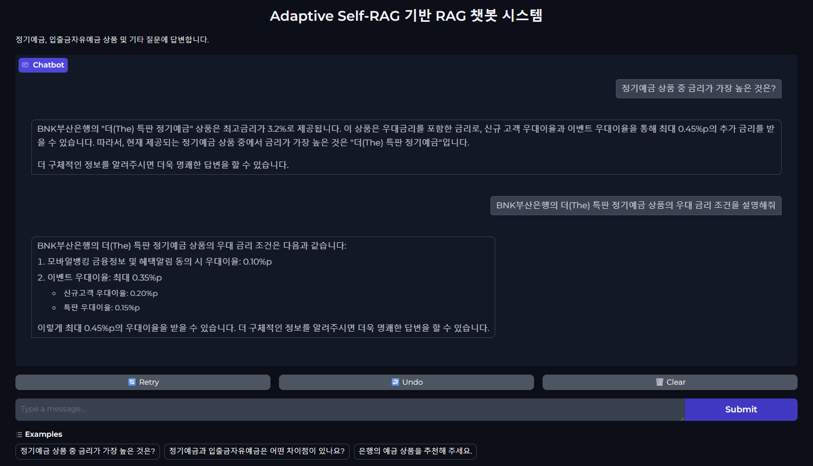

# Adaptive Self-RAG 기반 개인화 금융상담 챗봇

## 1. 프로젝트 소개

이 프로젝트는 금융 상품 관련 질문(정기예금, 입출금자유예금, 대출 등)에 대해 개인화된 상담을 제공하는 것을 목표로 합니다. Adaptive Self-RAG 기법을 활용하여 사용자의 질문을 분석하여 적절한 문서를 검색하고 질문의 특성과 문서의 품질에 따라 질문을 재구성하거나 직접 답변을 생성하여 정확도를 높이는 AI 챗봇 시스템입니다.

---

## 2. 주요 기술 스택 및 사용 모델

### **LLM 모델 (gpt-4o-mini)**

* OpenAI의 GPT-4o-mini 모델 사용
* 금융 및 일반 질의응답에서 빠르고 정확한 응답 생성에 적합

### **주요 프레임워크 및 모듈**

* **LangChain & LangGraph**: 복잡한 RAG(Retrieval-Augmented Generation) 파이프라인 구축
  - LangGraph를 통해 시스템의 각 단계를 명확히 분리하고, 질문 분석, 검색, 답변 생성을 효과적으로 연결하는 상태 기반 플로우 구축
* **HuggingFace Embeddings**: 문서 및 질의 임베딩 생성
* **ChromaDB**: 문서 데이터 저장
* **Hybrid Search**: bm25 + vector search로 단어 유사도와 의미 유사도를 함께 고려하여 문서 탐색
* **Gradio**: 사용자 친화적인 챗봇 웹 인터페이스 제공

---

## 3. 시스템 아키텍처

### 랭그래프 구조

다음 다이어그램은 구축된 Adaptive Self-RAG 체인의 전체 프로세스를 나타냅니다:



### 히스토리 기반 개인화

* 이전 답변이 있다면 이를 참고하여 문맥에 맞게 질문을 재작성
* 사용자와의 질의응답을 기억하며 요구에 적합한 답변 생성

### 질문 라우팅

* 사용자 질문을 분석하여 금융상품 관련 질문인지 일반 질문인지 구분
* 금융 질문은 문서 검색을 통해, 일반 질문은 LLM에서 바로 처리

### 병렬 서브 그래프 문서 검색

* 질문에 필요한 문서 검색 도구를 LLM이 판단하여 도구 호출
* 예금, 적금, 대출 상품 데이터를 ChromaDB에서 병렬로 검색
* 검색 결과의 관련성 평가 후 최적의 문서만을 필터링

### 답변 생성 및 평가

* 관련 문서를 기반으로 GPT-4o-mini 모델이 질문에 대한 답변을 생성
* 생성된 답변의 품질을 환각과 관련성 측면에서 LLM이 직접 평가
* 필요시 질문 재작성 후 재검색 및 답변 재생성 하는 self-RAG 방식 구현

---

## 4. Adaptive-Self 로직 및 기능

본 시스템은 **Adaptive-RAG**와 **Self-RAG** 방식을 결합하여 고품질의 답변을 생성합니다.

- Adaptive-RAG의 쿼리 분석과 능동적 자기수정 방식을 채택하여 금융문서의 탐색이 필요한지, 유저의 의도에 맞는 답변을 위해 질문 재작성을 판단하도록 설계했습니다.
- Self-RAG의 자가판단을 채택하여 검색된 문서가 질문과 실제로 관련 있는지 판단하고 생성된 답변이 문서를 충분히 뒷받침하는지 검토하고 전체적으로 답변이 유용한지 스스로 평가하도록 구축하였습니다.

Adaptive-Self RAG는 기본적인 RAG 시스템을 넘어 아래의 기능을 구축합니다:

- **질문 분석 및 라우팅**: 질문이 금융 관련인지 일반적인 것인지를 판단하여 불필요한 문서 탐색을 방지합니다.
- **자기 주도적인 문서 검증**: 검색된 문서의 품질을 자체적으로 평가하고 부족한 정보를 보완하기 위해 질문을 재작성한 후 추가 문서를 탐색하여 답변 품질을 개선합니다.
- **답변 품질 평가**: 생성된 답변이 관련 문서의 내용에 근거하는지 평가하고 환각(hallucination) 여부를 점검합니다.
- **개인화된 답변 생성**: 이전 대화 기록을 기반으로 사용자의 요구를 파악하고, 이를 바탕으로 개인화된 답변을 생성합니다.


이를 통해 사용자의 질문을 분석하고 필요에 따라 질문을 재구성하거나 적합한 문서를 선택하여 맥락에 맞는 응답을 생성하고 이에 대한 타당성을 스스로 검토한 후 답변을 제공하는 Adaptive-Self RAG 시스템을 구현했습니다.


---

## 5. 질문 라우팅 및 문서 탐색 평가

OpenAI의 GPT-4o-mini를 사용하여 답변에 필요한 적절한 문서를 찾기만 한다면 Adaptive-self 로직에의해 어느정도 품질 보장이 가능한 답변 생성합니다. 따라서 질문 라우팅과 문서 탐색 로직이 중요하여 질문지와 답변생성에 필요한 문서를 매칭시켜 평가지를 만들어 질문분석과 문서탐색 로직에 대한 평가를 진행하였습니다.

1. 질문에 대해서 금융질문으로 적절하게 판단을 하는가?
2. 최종 탐색된 문서가 평가지의 정답문서(gold)와 일치하는가?

###  Q-D mapping*.csv

* 금융상품에 대한 추천 혹은 질문과 그에 대한 올바른 답변 문서로 이루어진 평가지
* 질문은 사용자의 나이, 직업, 현재 처한 상황 등 개인화된 환경요인이 반영되어 있으며 은행 혹은 상품에 대한 질의로 구성됨
* 정답 문서는 해당 질문에 적절하게 답변하기 위해 필요한 문서
* QDmapping은 단일 문서와 멀티 문서로 나누어져 있으며 멀티의 경우 동일 카테고리의 2개 상품으로 구성됨

### 평가결과

| algo   | embed | single\_router\_acc | multi\_router\_acc | single\_p | single\_r | single\_f1 | multi\_p | multi\_r | multi\_f1 |
| ------ | ----- | ------------------- | ------------------ | --------- | --------- | ---------- | -------- | -------- | --------- |
| vector | bge   | 0.820               | 1.000              | 0.047     | 0.140     | 0.070      | 0.000    | 0.000    | 0.000     |
| hybrid | bge   | 0.820               | 1.000              | 0.468     | 0.610     | 0.508      | 0.342    | 0.415    | 0.367     |
| vector | mini  | 0.820               | 1.000              | 0.017     | 0.050     | 0.025      | 0.013    | 0.020    | 0.016     |
| vector | ko    | 0.820               | 1.000              | 0.153     | 0.460     | 0.230      | 0.083    | 0.125    | 0.100     |
| hybrid | mini  | 0.820               | 1.000              | 0.460     | 0.610     | 0.503      | 0.348    | 0.415    | 0.370     |
| hybrid | ko    | 0.820               | 1.000              | 0.455     | 0.620     | 0.502      | 0.335    | 0.400    | 0.357     |
| vector | kf    | 0.830               | 1.000              | 0.133     | 0.400     | 0.200      | 0.023    | 0.035    | 0.028     |
| hybrid | kf    | 0.830               | 1.000              | 0.462     | 0.620     | 0.507      | 0.322    | 0.395    | 0.348     |


---

## 6. 사용자 인터페이스 (Gradio)

* Gradio 기반의 웹 인터페이스 제공



---

## 7. 설치 및 실행 방법

```bash
# 프로젝트 복제
git clone https://github.com/iiiiiiiinseong/adaptive_self_rag.git
cd adaptive_self_rag

# OpenAI의 api key 환경변수 설정 필요
pip install -r requirements.txt
python src/adaptive_self_rag.py
